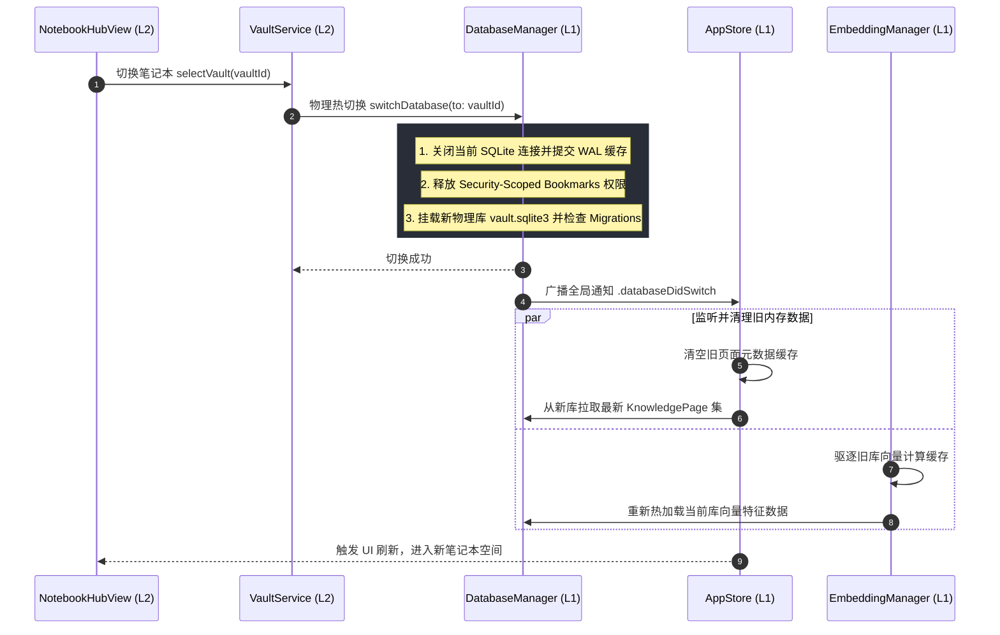
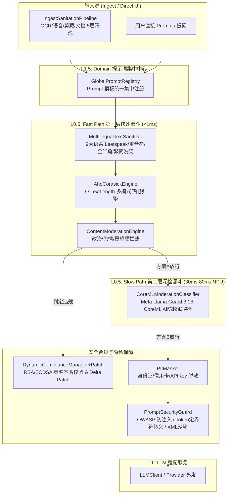

# 智宇 (ZhiYu) 概要设计文档 (High Level Design)

**版本**：2.1  
**作者**：架构师团队  
**日期**：2026-06-23  

---

## 1. 物理与逻辑 SPM 模块化分层架构

智宇采用基于 **Swift Package Manager (SPM)** 的本地多包物理隔离架构，系统分层依赖自顶向下单向流转，编译期物理卡绝反向越级依赖。

```mermaid
graph TD
    subgraph "L3: 应用调度层 (ZhiYu App)"
        ZApp[ZhiYuApp]
        Router[Router / Navigation]
        Env[AppEnvironment]
    end

    subgraph "L2: 业务功能切片包 (Packages/ZhiYuFeatures)"
        Feat_AI[ZhiYuFeaturesAI]
        Feat_K[ZhiYuFeaturesKnowledge]
        Feat_Ins[ZhiYuFeaturesInsight]
    end

    subgraph "L1.5: 智宇业务领域大脑 (Packages/ZhiYuDomain)"
        DomainModels[KnowledgePage / PageChunk / DTOs]
        MemProto[MemoryEngineProtocol]
        PromptConst[PromptConstants]
    end

    subgraph "L1: 智宇 AI 中台适配包 (Packages/ZhiYuAICore)"
        Sanitizer[PromptSecuritySanitizer]
        Reranker[ContextReranker]
        NativeMem[NativeMemoryEngine]
        SwarmMem[SwarmMemoryAdapter]
    end

    subgraph "L1: 通用存储引擎包 (Packages/UFPStorage)"
        SQLiteEngine[GRDBReexport / GRDB 物理隔离与重导出]
        StorageConst[StorageConstants (纯通用引擎配置)]
    end

    subgraph "Shared: 通用设计系统包 (Packages/UFPDesignSystem)"
        DesignTokens[Spacing / Color / Typography Tokens]
        ModuleBundle[Bundle.module 资源分发]
    end

    subgraph "L0: 通用底座包 (Packages/UFPCore)"
        DI[ServiceContainer DI 容器]
        Logger[Logger 日志]
        AppConst[AppConstants]
    end

    ZApp --> Feat_AI
    ZApp --> Feat_K
    ZApp --> Feat_Ins

    Feat_AI --> DomainModels
    Feat_AI --> Sanitizer
    Feat_AI --> DesignTokens

    Feat_K --> DomainModels
    Feat_K --> SQLiteEngine

    Sanitizer --> DomainModels
    Sanitizer --> SQLiteEngine
    
    DomainModels --> DI
    SQLiteEngine --> DI
    DesignTokens --> DI
```

        subgraph "记忆与 Agent 框架适配器集 (Memory Adapters)"
            NatMem[NativeMemoryEngine]
            SwarmAdapter[SwarmMemoryAdapter / Wax]
        end

        SQLStore[SQLiteStore / GRDB]
        EmbedMgr[EmbeddingManager]
        Chunker[TextChunkerProcessor]
    end

    subgraph "L0.5: 系统集成层 (Sources/Core/System)"
        Sys_Log[Logger]
        Sys_Sec[SecurityManager]
        Sys_Act[ActivityService / LiveActivity]
    end

    subgraph "L0: 底层基座层 (Sources/Core/Base)"
        DI[ServiceContainer]
        Proto[Base Protocols]
        Const[AppConstants]
    end

    %% 依赖流向关系 (严格自顶向下)
    ZApp --> Feat_K & Feat_AI
    Feat_K & Feat_AI --> RAGOrch
    RAGOrch --> LLMSvc & SQLStore & EmbedMgr
    LLMSvc & SQLStore & EmbedMgr --> Sys_Log & Sys_Sec
    Sys_Log & Sys_Sec --> DI & Proto
```

---

## 2. 核心模块交互时序

### 2.1 物理多笔记本 (Vault) 热插拔切换时序

在多 Vault 架构中，系统通过 WAL 机制安全挂载不同的物理 `.sqlite3` 数据库文件。


```mermaid
sequenceDiagram
    autonumber
    participant UI as NotebookHubView (L2)
    participant VS as VaultService (L2)
    participant DB as DatabaseManager (L1)
    participant AS as AppStore (L1)
    participant EM as EmbeddingManager (L1)

    UI->>VS: 切换笔记本 selectVault(vaultId)
    VS->>DB: 物理热切换 switchDatabase(to: vaultId)
    
    rect rgb(40, 45, 55)
        Note over DB: 1. 关闭当前 SQLite 连接并提交 WAL 缓存
        Note over DB: 2. 释放 Security-Scoped Bookmarks 权限
        Note over DB: 3. 挂载新物理库 vault.sqlite3 并检查 Migrations
    end
    
    DB-->>VS: 切换成功
    DB->>AS: 广播全局通知 .databaseDidSwitch
    
    par 监听并清理旧内存数据
        AS->>AS: 清空旧页面元数据缓存
        AS->>DB: 从新库拉取最新 KnowledgePage 集
    and
        EM->>EM: 驱逐旧库向量计算缓存
        EM->>DB: 重新热加载当前库向量特征数据
    end
    
    AS-->>UI: 触发 UI 刷新，进入新笔记本空间
```

---

## 3. 数据流向图 (Data Flow Diagram - DFD)

### 3.1 数据摄入与 RAG 构建流 (DFD Level 1)

从物理媒介（PDF、Markdown、剪贴板、语音）到混合检索就绪的全生命周期数据加工与转换链路：

```
[外部输入] ──► (1.0 物理文件解析) ──► [纯文本/元数据]
                      │
                      ▼
               (2.0 语义分块) ──► [PageChunk 数组]
                      │
                      ├───────────────────────┐
                      ▼                       ▼
              (3.0 文本向量化)         (4.0 Wiki 链接分析)
                      │                       │
                      ▼                       ▼
              [Vector 向量缓存]       [双向链接关系网]
                      │                       │
                      ▼                       ▼
              (5.0 向量库写入)         (6.0 SQLite 写入)
                      │                       │
                      ▼                       ▼
              [(Vector Store Cache)]  [(vault.sqlite3 FTS5)]
```

---

## 4. 关键接口与依赖倒置协议 (DIP)

为了保证 L1.5/L2 与底层的彻底解耦，系统定义了一系列能力协议，所有依赖必须面向接口：

### 4.1 核心存储契约: `AnyPageStoreCapabilities`
```swift
/// @Sources/Domain/Protocols/AnyPageStoreCapabilities.swift
public protocol AnyPageStoreCapabilities: Sendable {
    func fetchPages() async throws -> [KnowledgePage]
    func insertPage(_ page: KnowledgePage) async throws
    func updatePage(_ page: KnowledgePage) async throws
    func deletePage(id: UUID) async throws
}
```

### 4.2 核心模型推理契约: `LLMServiceProtocol`
```swift
/// @Sources/Domain/Protocols/LLMServiceProtocol.swift
public protocol LLMServiceProtocol: Sendable {
    func directChat(systemPrompt: String, query: String, history: [ChatMessageDTO]) async throws -> ChatMessageDTO
    func directChatStream(systemPrompt: String, query: String, history: [ChatMessageDTO]) -> AsyncThrowingStream<String, Error>
    func generate(prompt: String, systemPrompt: String) async throws -> String
    func rerank(query: String, candidates: [any KnowledgePageRepresentable]) async throws -> [any KnowledgePageRepresentable]
}
```

---

## 5. 已知架构偏差与代码质量全景

### 5.1 跨层访问违例一览 (截至 2026-06)

| 严重度 | 源文件 | 问题描述 |
|--------|--------|----------|
| 🔴 P0 | `Sources/Core/Base/Protocols/RouterProtocol.swift:41,48` | L0 协议引用 L3 类型 `ToolItem`、`AppTab` |
| 🔴 P0 | `Sources/Domain/Models/RAGModels.swift:12` | Domain 层依赖 L0 `import GRDB` (3 文件) |
| 🔴 P0 | `Sources/Features/Knowledge/Vault/Service/VaultService.swift:13-14` | L2 业务服务 `import GRDB` + `import SwiftUI` 双跨层 |
| 🟡 P1 | `Sources/Core/Base/Protocols/LLMProtocols.swift:29` | L0 协议引用 Domain 类型 |
| 🟡 P1 | `Sources/Infrastructure/Storage/Sync/iCloudSyncCoordinator.swift:21-22` | L1 同步协调器引用 L3 AppStore |

### 5.2 模块健康度矩阵（2026-06-23 更新）

| 模块 | 文件数 | 主要改进方向 |
|------|--------|-------------|
| `Core/` | 76 | 并发安全 (@unchecked Sendable → actor) |
| `Infrastructure/` | 99 | PluginRegistry SRP 拆分完成（706→159） |
| `Domain/` | 53 | GRDB import 已清零 ✅ |
| `Features/` | 208 | #if os 宏 46→10 ✅, 9 文件 SRP 重构完成 ✅ |
| `Shared/` | 103 | PlatformModifiers 协议化, SRP 拆分（3 文件） |
| `Platforms/` | 62 | 新增 12 个协议实现类 + 3 个 Registrar |
| `App/` | 18 | AuthView/AuthService/SynthesisView 拆分 |
| `Localization/` | 41 | — |
| **合计** | **660** | P0/P1 全部清零 ✅ |

### 5.3 已完成的代码质量修复

| 阶段 | 完成项 | 涉及文件 |
|------|--------|----------|
| 架构审计 | 602 文件 18 维度全量代码审计（2026-06-22） | 全项目 |
| P0 修复 | 98 个 View 文件 `[L2]`→`[L3]` 层级标注修正 | 98 文件 |
| P0 修复 | 12 个 Domain/Models 文件描述去模板化 | 12 文件 |
| P1 修复 | 17 处硬编码 URL + 18 处 UserDefaults key → `AppConstants` | 13 文件 |
| P1 修复 | `#if os()` 宏协议化：Phase 1（46→19）+ Phase 2（19→10） | 11 文件 + 12 新文件 |
| P1 修复 | `@preconcurrency import SwiftUI` 清理 | 4 文件 |
| P1 修复 | `iOSSpeechService` 宏密度降低（10→4 处） | 1 文件 → 2 文件 |
| P1 修复 | 14 大文件 SRP 重构（9 主文件 → 34 新文件） | 9 文件 + 34 新文件 |
| CI 增强 | 3 个新 Gatekeeper 脚本 + 12 个 CI 检查项全量通过 | Tools/scripts/ |
| 测试增强 | 17 个跨平台协议单元测试 + 852 全量测试通过 | Tests/Unit/ |
| 文档更新 | 新增 `PLATFORM_PROTOCOL_ARCHITECTURE.md` + `srp-file-organization.md` | 2 新文档 |
| Docker 清理 | 释放 206 GB (85%) — 清理 120+ 旧版镜像 | 3 个微服务 |
| Mock 服务重构 | 抽取 mock_constants.py, 消除重复参数模板 | 4 Python 文件 (-191 行) |

> **审计报告**：[`Tools/Audit/ZhiYu_Codebase_Audit_2026-06-22.md`](../../Tools/Audit/ZhiYu_Codebase_Audit_2026-06-22.md) — P0/P1 全部清零 ✅

---

## 6. 全局 AI Prompt 统一集中管理与双层漏斗安全合规架构 (2026-08)

为杜绝 Prompt 散落硬编码、绕过合规监管与 OWASP Prompt Injection 注入风险，系统构建了贯穿 L0.5 至 L1.5 的**双层漏斗安全防御架构 (Tiered Funnel Defense Architecture)** 与全流程治理体系：


```mermaid
graph TD
    subgraph "输入源 (Ingest / Direct UI)"
        Ingest[IngestSanitationPipeline<br/>OCR/语音/剪藏/文档 5层清洗]
        UserInput[用户直接 Prompt / 提问]
    end

    subgraph "L1.5: Domain 提示词集中中心"
        Registry[GlobalPromptRegistry<br/>Prompt 模板统一集中注册]
    end

    subgraph "L0.5: Fast Path 第一层快速漏斗 (<1ms)"
        Sanitizer[MultilingualTextSanitizer<br/>9大语系 Leetspeak/重音符/全半角/繁简洗词]
        ACEngine[AhoCorasickEngine<br/>O-TextLength 多模式匹配引擎]
        Moderation[ContentModerationEngine<br/>政治/色情/暴恐硬拦截]
    end

    subgraph "L0.5: Slow Path 第二层深检漏斗 (30ms-80ms NPU)"
        CoreMLGuard[CoreMLModerationClassifier<br/>Meta Llama Guard 3 1B CoreML AI防越狱深检]
    end

    subgraph "安全合规与隐私保障"
        DynamicPatch[DynamicComplianceManager+Patch<br/>RSA/ECDSA 策略签名校验 & Delta Patch]
        PII[PIIMasker<br/>身份证/信用卡/APIKey 脱敏]
        Guard[PromptSecurityGuard<br/>OWASP 防注入 / Token定界符转义 / XML沙箱]
    end

    subgraph "L1: LLM 适配服务"
        LLM[LLMClient / Provider 外发]
    end

    Ingest --> Registry
    UserInput --> Registry
    Registry --> Sanitizer
    Sanitizer --> ACEngine
    ACEngine --> Moderation
    Moderation -->|方案A放行| CoreMLGuard
    CoreMLGuard -->|方案B放行| PII
    PII --> Guard
    Guard --> LLM
    Moderation -->|判定违规| DynamicPatch
```

### 核心演进特性

1. **双层漏斗安全防御架构 (Tiered Funnel Defense)**：
   - **第一层 Fast Path (方案 A)**：`MultilingualTextSanitizer` (9 大语系 Leetspeak 还原、重音符剥离、全半角归一) + `AhoCorasickEngine` (<1ms 耗时，0% NPU 消耗)，毫秒级拦截 80% 明文显性违规与敏感词。
   - **第二层 Slow Path (方案 B)**：`CoreMLModerationClassifier` (集成 Meta Llama Guard 3 1B CoreML 小模型)，在 Apple Neural Engine NPU 硬件上做 30ms 深度 AI 语义防越狱分类，专门拦截隐藏极深的 DAN 角色扮演与 Prompt 注入。
2. **云端策略 RSA/ECDSA 数字签名与 Delta Patch (`DynamicComplianceManager+Patch`)**：
   - 使用 Apple `Security.framework` `SecKeyVerifySignature` 对云端 RemoteConfig JSON 下发策略实施 RSA/ECDSA 公钥防篡改验签；校验通过后自动执行 `configVersion` 增量 Delta Patch 合并。
3. **三端 0 编译告警静态门禁 (`check-code-compiler-warnings.py`)**：
   - 抓取 iOS / macOS Catalyst / watchOS 三端 Xcode 编译日志，阻断任何包含警告的代码提交。```

### 6.1 核心合规与安全防护组件

1. **GlobalPromptRegistry (`Domain/Prompt`)**:
   - 应用级 System Prompt 统一集中注册中心，禁止在 View/Service 中硬编码 Prompt 文本。
   - 自动包含变量模版渲染与输入内容定界符包裹逻辑。
2. **IngestSanitationPipeline (`Infrastructure/Processors`)**:
   - 多模模态摄入清洗流水线，包含 `stripControlCharacters` (不可见字符剥离), `normalizeUnicode` (Unicode 正规化), `mergeOCRLineBreaks` (OCR 断行修复) 与 `stripHTMLNoise` (网页标签剥离)。
3. **ContentModerationEngine (`Core/System/Security`)**:
   - 政治反动 (`politicalReactionary`)、黄色色情 (`adultNSFW`)、暴恐涉禁 (`violenceTerrorism`) 的**零容忍物理硬阻断**（绝对禁止外发 LLM），抛出 `PromptComplianceError.contentViolatesPolicy`。
4. **DynamicComplianceManager (`Core/System/Security`)**:
   - 支持结合 `L10n.Security` (9 大语言: 简中, 繁中, 英, 日, 韩, 西, 法, 阿, 俄) 与 `RemoteConfigService` 云端 JSON 热更新的动态合规告示与正则词库管理架构。
5. **PromptSecurityGuard & PIIMasker (`Core/System/Security`)**:
   - **PIIMasker**: 身份证号、信用卡号、API Key / Secret Token、邮箱与手机号码的自动 `[REDACTED_PII]` 脱敏。
   - **PromptSecurityGuard**: OWASP Anti-Injection、定界符转义（`<|im_start|>`、`### System:` 等 Token 安全中和）与 XML 金沙箱包裹。
### 6.2 多端协同与实时活动架构 (Live Activity, Widgets & Apple Watch Sync)

1. **iOS 灵动岛 (Live Activity & Dynamic Island)**：
   - 依赖 `ActivityService` 调度 `Activity<AIProcessingAttributes>` 状态机。
   - 包含 **AI 合成实验室**、**文档 Ingest & OCR** 与 **语音笔记转写** 3 大场景，支持在 Dynamic Island (Compact Leading/Trailing, Expanded) 与锁屏 Live Activity Widget 实时渲染进度条、引用源数量与剩余估计时间。
2. **桌面与锁屏小组件 (Widgets Extension)**：
   - 包含 **每日 AI 洞察/闪念小组件 (`DailyInsightWidgetView`)**、**知识库分布小组件 (`KnowledgeDistributionWidgetView`)** 与 **极速捕获小组件 (`QuickCaptureWidgetView`)**。
   - 通过 `VaultWidgetSyncManager` 定时将统计快照写回 App Group (`group.com.zhiyu.app`) 的 `widget_stats.json` 共享文件，实现零进程间 IPC 耗费的秒级跨进程渲染。
3. **Apple Watch (watchOS) 专属扩展**：
   - **`WatchDailyInsightView`**：支持在手表端以卡片轮播形式翻阅每日 AI 炼化出的金句洞察与闪念卡片。
   - **`WatchVoiceCaptureView`**：手表端极速语音灵感捕捉，录音听写后自动通过 App Group 与 `WCSession` (WatchConnectivity) 静默同步回 iOS 存储管道。

---
*本文档为智宇系统的高阶概要设计，实现细节请参阅详细设计 [DETAILED_DESIGN.md](../Design/DETAILED_DESIGN.md)。*

