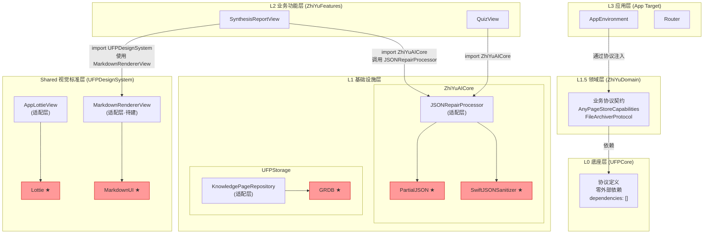

# 智宇 (ZhiYu) L0-L3 跨层依赖与调用限制规范

本规范定义了智宇 (ZhiYu) 项目中垂直化功能架构 (Vertical Slices) 各层级之间的物理依赖与调用约束。旨在杜绝反向依赖、削减组件耦合、确保 L1.5 领域层的纯净化，并对齐 Swift 6 严格并发标准。

---

## 1. 架构层级拓扑与核心职责

项目遵循垂直化功能架构，将代码物理划分为以下层级：

| 层级 | 名称 | SPM 物理包 | 物理路径 | 核心职责 | 依赖限制说明 |
| :--- | :--- | :--- | :--- | :--- | :--- |
| **L3** | 应用层 (App) | `ZhiYu` App Entry | `Sources/App/` | 全局入口、环境配置、路由中心 | 可依赖所有 SPM 模块 |
| **L2** | 业务功能层 (Features) | `ZhiYuFeatures` | `Packages/ZhiYuFeatures/` | 业务域分组切片 (AI/Knowledge/Insight) | 依赖 `ZhiYuDomain`, `ZhiYuAICore`, `UFPDesignSystem`, `UFPCore` |
| **L1.5** | 领域层 (Domain) | `ZhiYuDomain` | `Packages/ZhiYuDomain/` | **核心业务大脑**：业务规则、RAG 契约 | 仅依赖 `UFPCore`！**绝对平台无关**！ |
| **L1** | 基础设施层 (Infra) | `ZhiYuAICore` / `UFPStorage` | `Packages/ZhiYuAICore/`, `Packages/UFPStorage/` | AI 适配、Rerank 降噪与 GRDB 物理存储 | 严禁反向依赖 L2/L3 |
| **L0.5/L0** | 底层基座层 (Base) | `UFPCore` | `Packages/UFPCore/` | 内核：DI 容器、Logger、全局协议定义 | 极简内核，无业务逻辑，绝对零外部/上层依赖 |
| **Shared** | 共享标准层 | `UFPDesignSystem` | `Packages/UFPDesignSystem/` | 视觉标准：Design Token、Bundle.module | 仅供 UI 视图引用，严禁包含业务逻辑 |

---

## 2. 跨层依赖禁用矩阵 (Dependency Matrix)

以下矩阵详细定义了各物理层级之间的引用可行性。**行**代表调用源（Source Layer），**列**代表调用目标（Target Layer）。

| ↘️ 目标 \ ↙️ 源 | L3 (App) | L2 (Features) | L1.5 (Domain) | L1 (Infra) | L0.5 (System) | L0 (Base) | Shared |
| :--- | :---: | :---: | :---: | :---: | :---: | :---: | :---: |
| **L3 (App)** | - | ✅ 允许 | ✅ 允许 | ✅ 允许 | ✅ 允许 | ✅ 允许 | ✅ 允许 |
| **L2 (Features)** | 🚫 禁用 | ⚠️ 限制<sup>1</sup> | ✅ 允许 | 🚫 禁用<sup>2</sup> | ✅ 允许 | ✅ 允许 | ✅ 允许 |
| **L1.5 (Domain)** | 🚫 禁用 | 🚫 禁用 | - | 🚫 禁用<sup>3</sup> | ✅ 允许 | ✅ 允许 | 🚫 禁用 |
| **L1 (Infra)** | 🚫 禁用 | 🚫 禁用 | ✅ 允许<sup>4</sup> | - | ✅ 允许 | ✅ 允许 | 🚫 禁用 |
| **L0.5 (System)** | 🚫 禁用 | 🚫 禁用 | 🚫 禁用 | 🚫 禁用 | - | ✅ 允许 | 🚫 禁用 |
| **L0 (Base)** | 🚫 禁用 | 🚫 禁用 | 🚫 禁用 | 🚫 禁用 | 🚫 禁用 | - | 🚫 禁用 |
| **Shared** | 🚫 禁用 | 🚫 禁用 | 🚫 禁用 | 🚫 禁用 | 🚫 禁用 | ✅ 允许 | - |

> **注解说明**：
> 1. **L2 ↔ L2 同层限制**：不同 Feature 切片（如 PageList 和 Chat）之间严禁强耦合，必须通过 L3 路由中转或 L1.5 领域中介进行解耦通讯。
> 2. **L2 🚫 L1 直接穿透禁用**：UI 视图层严禁直接引用或硬编码具体基础设施实现类（如 `SQLiteStore`）。必须通过 `ServiceContainer` 注入定义在 Base/Domain 中的抽象协议。
> 3. **L1.5 🚫 L1 物理硬编码禁用**：领域层定义规则与接口契约，严禁依赖具体物理实现。
> 4. **L1 ⚠️ L1.5 纯净通信**：L1 只允许导入 L1.5 定义的实体模型 (Domain Models) 和服务契约协议，用以实现协议的具体细节。

---

## 3. 反向依赖与跨层越权红线 (Architectural Violations)

### 红线 1：L1.5 领域层非纯净化 (Domain Purity Violation)
*   **违规行为**：在 `Sources/Domain/` 的任何文件中出现 `import UIKit`、`import AppKit`、`import SwiftUI` 或 `import ActivityKit`。
*   **惩罚机制**：CI 静态检查直接阻断，触发编译熔断。
*   **最佳实践**：如果领域层需要感知系统状态或执行 UI 触发，必须在 `Sources/Core/Base/` 或 `Sources/Domain/Protocols/` 定义协议（例如 `any NotificationDispatcherCapabilities`），并在 App 层或 System 层实现，通过依赖注入机制传入。

### 红线 2：底层（L0/L0.5/L1）反向导入上层（L2/L3）
*   **违规行为**：基础设施、系统封装或基座组件中，直接 `import Features` 或直接引用具体的上层 Store/View（如 `AppStore`、`ChatViewModel`）。
*   **危害**：这将导致严重的循环依赖，导致无法生成独立的静态库，且 Swift 6 严格并发会报数据竞争警告。
*   **最佳实践**：采用**依赖倒置原则 (DIP)**，下层只声明接口，由上层负责实现，并将具体实现注册至 `ServiceContainer` 中。

### 红线 3：UI 视图穿透依赖物理存储引擎
*   **违规行为**：在 SwiftUI 的 View 中直接声明 `let db = DatabaseManager.shared`。
*   **危害**：使 UI 与 SQLite/CloudKit 物理引擎强绑定，无法进行无数据 Mock 的快照测试 (Snapshot Tests) 和单元测试。
*   **最佳实践**：通过 `@Inject var pageStore: any AnyPageStoreCapabilities` 进行协议注入。

---

## 4. 依赖注入与解耦标准模式

为了确保各层级松耦合，推荐使用以下标准解耦模式：

### 4.1 协议定义在下层 (或 L1.5 Domain)
```swift
/// 物理路径: Sources/Domain/Protocols/AI/ChatServiceType.swift
/// 核心业务大脑定义的 AI 对话服务契约
public protocol ChatServiceType: Sendable {
    func sendMessage(_ content: String) async throws -> String
}
```

### 4.2 具体实现在物理下沉层 (L1 Infra)
```swift
/// 物理路径: Sources/Infrastructure/AI/OpenAIChatService.swift
/// 具体的 OpenAI 接入实现
import Foundation

public final class OpenAIChatService: ChatServiceType {
    private let client: any AnyLLMClientCapabilities
    
    public init(client: any AnyLLMClientCapabilities) {
        self.client = client
    }
    
    public func sendMessage(_ content: String) async throws -> String {
        // 具体请求逻辑...
        return "AI Response"
    }
}
```

### 4.3 全局入口注册 (L3 App)
```swift
/// 物理路径: Sources/App/ZhiYuApp.swift
import Foundation

extension ServiceContainer {
    func registerServices() {
        // 注册具体的基础设施实现给对应的抽象服务协议
        register(type: ChatServiceType.self) {
            OpenAIChatService(client: resolve(AnyLLMClientCapabilities.self))
        }
    }
}
```

### 4.4 业务视图解耦引用 (L2 Feature)
```swift
/// 物理路径: Sources/Features/Chat/ChatViewModel.swift
import SwiftUI

@MainActor
public final class ChatViewModel: ObservableObject {
    // 强制只依赖协议，通过 DI 容器自动注入，免除具体类依赖
    @Inject private var chatService: ChatServiceType
    
    @Published public var messages: [String] = []
    
    public func send(text: String) async {
        do {
            let reply = try await chatService.sendMessage(text)
            self.messages.append(reply)
        } catch {
            // 优雅错误处理
        }
    }
}
```

---

## 5. 已知违例案例与修复指引

### 红线 4：L0 基座层引用 L3 应用层类型

> ✅ **已修复** (2026-06-24)：`ToolItem` 已下移至 `Domain/Models/ToolItem.swift` (L1.5)，L0 RouterProtocol 自然解析。`AppRoute`/`SidebarSelection` 属 L3 导航概念，RouterProtocol 已用 `#if !os(watchOS)` 隔离，维持现状。

*   **已修复**：
    - `ToolItem` 从 L3 `AppModels.swift` 移至 L1.5 `Domain/Models/ToolItem.swift` ✅
    - `RouterProtocol` 使用未限定 `ToolItem` → 自然解析至 L1.5 ✅
    - `AppStore.ToolItem` 替换为全局 `ToolItem` + `extension ToolItem { var route }` ✅
*   **维持现状**：
    - `AppRoute`、`SidebarSelection` — L3 导航概念，RouterProtocol 中已 `#if !os(watchOS)` 隔离
    - `AppTab` — 已在 `Domain/Models/AppTab.swift` (L1.5)，L0→L1.5 合规 ⚠️ 审计误报

### 红线 5：L1-L2 领域/业务层直接 import 框架实现

> ✅ **全部已修复** (2026-06-24)：SRP 重构使 GRDB 依赖移至 VaultDatabaseSwitcher 协议，SwiftUI 改为 Observation。

*   **已修复** (共 6 处)：
    - `Domain/Models/RAGModels.swift` — GRDB import 已删除 ✅
    - `Domain/Models/PluginRecord.swift` — GRDB import 已删除 ✅
    - `Domain/Models/PluginRecordFTS.swift` — GRDB import 已删除 ✅
    - `Features/Vault/VaultService.swift` — `@preconcurrency import GRDB` 已删除 ✅
    - `Features/Knowledge/System/Model/KnowledgeStore.swift` — `import SwiftUI`→`import Observation` ✅
    - `Features/Knowledge/NotebookHub/Model/NotebookThemeFactory.swift` — `import SwiftUI` 已删除 ✅

> **违规清单已清零** 🎉

*   **危害**：领域模型与 GRDB 绑定则无法在不同持久化方案间切换；业务层引入 SwiftUI 则无法在非 UI 上下文中复用。
*   **最佳实践**：
    - Domain Models 保持纯 Swift struct，GRDB 映射在 L1 Repository 中通过 `extension Model: FetchableRecord` 实现
    - 非 View 文件使用 `import Observation` 而非 `import SwiftUI`
    - 所有数据访问通过 Repository 协议 (`Domain/Protocols/*Repository.swift`)

### 红线 6：使用 `NSLock` 而非 actor (Swift 6 严格并发禁止)
*   **违例文件**：`Sources/Infrastructure/Storage/Engine/DatabaseManager.swift:31` — 使用 `NSLock` 保护数据库连接
*   **其他受影响的 @unchecked Sendable 文件** (需审计)：

| 文件 | 声明 | 建议替代 |
|------|------|----------|
| `Core/Base/ServiceContainer.swift` | `@unchecked Sendable` + `os_unfair_lock` | `actor` |
| `Core/System/Security/SecurityManager.swift` | `@unchecked Sendable` + `NSLock` | `actor` 或 `os_unfair_lock` |
| `Core/System/Events/IntentRateLimiter.swift` | `@unchecked Sendable` | `actor` |
| `Core/System/Analytics/LocalAnalyticsService.swift` | `@unchecked Sendable` | `actor` |
| `Infrastructure/LLM/LLMService.swift` 系列 | `@unchecked Sendable` (14+ 类) | 逐类审计改为 actor |
| `PluginEnginePool.swift` | `os_unfair_lock` | 已符合安全，可保留 |

*   **危害**：Swift 6 严格并发模式下 `NSLock` 是非 Sendable 类型，会导致数据竞争警告。`@unchecked Sendable` 将安全检查责任转移给开发者，在大型团队中容易遗漏。
*   **最佳实践**：
    - 有可变状态的单例 → 改为 `actor`
    - 需要 `@MainActor` 隔离的类型 → 标注 `@MainActor final class`
    - 不可变值类型 → 标注 `struct: Sendable`
    - 真正需要 `os_unfair_lock` 的场景 → 封装到独立的 `Locked<T>` 包装器中

### 红线 7：业务层 (Features) 禁止直接使用 `#if os()` 平台宏

> ✅ **已修复** (2026-06-22)：经过 Phase 1+2 协议化改造，Features 层 `#if os()` 宏从 **46 处降至 10 处**（-78%）。剩余 10 处为 watchOS 结构性差异（如 `NavigationStack` vs `NavigationView`），属合理保留。

*   **违规行为**：在 `Sources/Features/` 和 `Sources/Domain/` 的任何文件中使用 `#if os(iOS)`、`#if os(macOS)`、`#if os(watchOS)` 宏。
*   **危害**：将平台差异散落在业务逻辑中，导致代码分支膨胀、难以测试、新增平台时需修改大量业务文件。
*   **最佳实践**（已验证生效）：
    1. 在 `Core/Base/Protocols/` 定义平台能力协议（`DeviceInfoProtocol`、`URLOpenerProtocol`、`ShareSheetProtocol`、`PasteboardProtocol`）
    2. 在 `Platforms/iOS/`、`Platforms/macOS/`、`Platforms/watchOS/` 分别实现（如 `iOSDeviceInfoService`、`MacURLOpenerService` 等共 12 个实现类）
    3. 通过 `PlatformRegistrar` 注册到 `ServiceContainer`，业务层通过 `@Inject` 注入协议
    4. UI 层面的平台差异使用 `PlatformModifiers` View extension（如 `adaptiveListStyle()`）
*   **例外**：`Platforms/` 目录本身、`Sources/App/` 入口层可合理使用 `#if os()` 宏。
*   **详细设计**：参见 [`Docs/Architecture/PLATFORM_PROTOCOL_ARCHITECTURE.md`](./PLATFORM_PROTOCOL_ARCHITECTURE.md)

### 红线 8：View 文件必须标注为 [L3]，不是 [L2]

> ⚠️ **审计发现** (2026-06-22)：**100 个 View 文件**错误标注为 `[L2] 业务功能层`，应标注为 `[L3] 表现层`。

*   **违规行为**：在 `Sources/Features/**/View/` 下的文件中，文件头标注 `系统层级：[L2]`。
*   **正确标注**：所有 View 文件应标注 `系统层级：[L3] 表现层`。
*   **区分规则**：
    - `[L2]` → Service、Model、ViewModel、Coordinator（不含 UI 框架依赖）
    - `[L3]` → View、ViewProvider、View Components（含 SwiftUI import）

---

## 6. 架构门禁自动扫描规范

为了确保规范在团队协作中不被突破，配置以下构建门禁（全部通过 `Tools/CI/Analyze/run_static_analysis.sh` 集成串行执行）：

| # | 脚本 | 检测内容 | 路径 |
|---|------|---------|------|
| 1 | `check_platform_macros.py` | Features/Domain 层 `#if os()` 宏阻断 | `Tools/Gatekeeper/` |
| 2 | `check_magic_strings.py` | 硬编码 URL / UserDefaults key 检测 | `Tools/Gatekeeper/` |
| 3 | `check_file_headers.py` | 文件层级标注 + 核心职责完整性验证 | `Tools/Gatekeeper/` |
| 4 | `check_architecture_dependency.py` | L0-L3 跨层非法依赖扫描 | `Tools/Gatekeeper/Architecture/` |
| 5 | `check_domain_purity.py` | Domain 层平台无关性（禁止 import UIKit/SwiftUI） | `Tools/Gatekeeper/Architecture/` |
| 6 | `check_hardcoded_secrets.py` | 硬编码密钥/Token 检测 | `Tools/Gatekeeper/Release/` |
| 7 | `check_magic_numbers.py` | 魔鬼数字/字符串检测（排除 Widget） | `Tools/Gatekeeper/Compliance/` |
| 8 | `check_localization.py` | 国际化字符串合规（禁止硬编码中文） | `Tools/Gatekeeper/Compliance/` |
| 9 | `check_layer_markers.sh` | 文件层级标注覆盖率统计 | `Tools/Gatekeeper/Architecture/` |
| 10 | `check_swift_quality.py` | Swift 注释、文件头、代码长度审计 | `Tools/Gatekeeper/Sanity/` |
| 11 | `check_root_hygiene.py` | 根目录垃圾文件/临时脚本扫描 | `Tools/Gatekeeper/Sanity/` |
| 12 | `check_test_di_setup.py` | 测试文件 DI Mock 环境完整性 | `Tools/Gatekeeper/Architecture/` |
| 13 | `check_complexity.py` | 🆕 圈复杂度门禁（SwiftLint cyclomatic_complexity, error≤10） | `Tools/Gatekeeper/Compliance/` |
| 14 | `check_view_duplication.py` | 🆕 启发式 View 结构与修饰符链复用沉淀门禁 | `Tools/Gatekeeper/Architecture/` |

> **执行方式**：本地开发使用 `bash Tools/CI/Analyze/run_static_analysis.sh`；CI 流水线同脚本自动执行。全部 **15 项**并行执行，任一项失败即熔断构建。完整的 CI 体系见 [`Docs/Architecture/CI_CD_WORKFLOW.md`](./CI_CD_WORKFLOW.md)。

---

## 7. 开源库适配层分层原则 (Open-Source Adapter Layer Policy)

### 7.1 设计动机

智宇引入了多个高质量外部开源库（GRDB、Lottie、ZIPFoundation、SwiftJSONSanitizer、PartialJSON、MarkdownUI）。如果业务层直接 `import` 这些库，会导致：

1. **依赖链污染**：切换/升级开源库时，业务层代码大量改动。
2. **测试阻断**：Unit Test 无法 Mock 开源库的具体行为，Snapshot Test 失效。
3. **分层破坏**：开源库类型侵入领域模型与协议定义，打破 L0-L3 单向依赖。

**解决方案**：所有开源库必须在匹配的 SPM 物理包中建立「适配层（Adapter Layer）」，上层只调用适配层暴露的 Swift 原生协议或类型。

### 7.2 UFP 包与开源库对应关系

> [!IMPORTANT]
> **核心原则：`UFPCore` 定义协议契约（零外部依赖），开源库的实现适配器分布到各自匹配的 UFP/ZhiYu 包中，严禁将开源库的 import 引入比适配层更上游的包。**

| 开源库 | 适配层所在包 | 适配器类 / 协议 | 上层调用方式 | 严禁直接 import 的位置 |
| :--- | :--- | :--- | :--- | :--- |
| **GRDB** | `UFPStorage` | `GRDBReexport` (`@_exported import GRDB`) | `import UFPStorage`（唯一允许 `import GRDB` 的包） | 除 `UFPStorage` 外所有包及 `Sources/` 层 |
| **Lottie** | `UFPDesignSystem` | `AppLottieView` | `import UFPDesignSystem` 使用 `AppLottieView` | 除 `UFPDesignSystem` 外所有包及 `Sources/` 层 |
| **MarkdownUI** | `UFPDesignSystem` | `MarkdownRendererView` | `import UFPDesignSystem` 使用 `MarkdownRendererView` | 除 `UFPDesignSystem` 外所有包及 `Sources/` 层 |
| **SwiftJSONSanitizer** + **PartialJSON** | `ZhiYuAICore` | `JSONRepairProcessor` | `import ZhiYuAICore` 调用 `JSONRepairProcessor.repair(_:)` | `ZhiYuDomain`, `ZhiYuFeatures`, App 层 |
| **ZIPFoundation** | `Platforms/iOS` | `ZIPFoundationArchiver` | 通过 `FileArchiverProtocol` 注入，`PluginLoader` 解耦 | 除 `ZIPFoundationArchiver.swift` 外所有文件 |

### 7.3 架构分层示意图


```mermaid
graph TD
    subgraph "L3 应用层 (App Target)"
        AppEnv["AppEnvironment"]
        Router["Router"]
    end

    subgraph "L2 业务功能层 (ZhiYuFeatures)"
        SynthView["SynthesisReportView"]
        QuizView["QuizView"]
    end

    subgraph "L1.5 领域层 (ZhiYuDomain)"
        DomainProto["业务协议契约\nAnyPageStoreCapabilities\nFileArchiverProtocol"]
    end

    subgraph "L1 基础设施层"
        subgraph "ZhiYuAICore"
            JSONRepair["JSONRepairProcessor\n(适配层)"]
            PartialJSON_lib["PartialJSON ★"]
            SanitizerLib["SwiftJSONSanitizer ★"]
        end
        subgraph "UFPStorage"
            Repo["KnowledgePageRepository\n(适配层)"]
            GRDB_lib["GRDB ★"]
        end
    end

    subgraph "Shared 视觉标准层 (UFPDesignSystem)"
        LottieView["AppLottieView\n(适配层)"]
        MDView["MarkdownRendererView\n(适配层·待建)"]
        Lottie_lib["Lottie ★"]
        MarkdownUI_lib["MarkdownUI ★"]
    end

    subgraph "L0 底座层 (UFPCore)"
        Protocols["协议定义\n零外部依赖\ndependencies: []"]
    end

    SynthView -->|"import ZhiYuAICore\n调用 JSONRepairProcessor"| JSONRepair
    SynthView -->|"import UFPDesignSystem\n使用 MarkdownRendererView"| MDView
    QuizView -->|"import ZhiYuAICore"| JSONRepair
    JSONRepair --> PartialJSON_lib
    JSONRepair --> SanitizerLib
    Repo --> GRDB_lib
    LottieView --> Lottie_lib
    MDView --> MarkdownUI_lib
    AppEnv -->|"通过协议注入"| DomainProto
    DomainProto -->|"依赖"| Protocols

    style PartialJSON_lib fill:#ff9999,stroke:#cc0000
    style SanitizerLib fill:#ff9999,stroke:#cc0000
    style GRDB_lib fill:#ff9999,stroke:#cc0000
    style Lottie_lib fill:#ff9999,stroke:#cc0000
    style MarkdownUI_lib fill:#ff9999,stroke:#cc0000
```

> ★ 红色节点 = 外部开源库，只允许出现在其所在适配层的包内，不得向上层渗透。

### 7.4 UFPCore 中的开源适配协议模板

`UFPCore` 不依赖任何外部库，但需定义上层可依赖的协议接口：

```swift
// Sources/Core/Base/Protocols/Adapters/JSONRepairCapable.swift
// 系统层级：[L0] 底层基座层
// 核心职责：JSON 自愈能力协议契约，由 ZhiYuAICore 中的 JSONRepairProcessor 实现
public protocol JSONRepairCapable: Sendable {
    static func repair(_ rawJSON: String) -> String
}

// Sources/Core/Base/Protocols/Adapters/FileArchiverProtocol.swift
// 核心职责：文件压缩/解压能力协议契约，由 iOSFileArchiver (Platforms) 实现
public protocol FileArchiverProtocol: Sendable {
    func zip(sourceDir: URL, to destination: URL) throws
    func unzip(archive: URL, to destination: URL) throws
}

// Sources/Core/Base/Protocols/Adapters/MarkdownRenderCapable.swift
// 核心职责：Markdown 渲染 View 协议契约，由 UFPDesignSystem 中的 MarkdownRendererView 实现
// (SwiftUI View 协议，由 UFPDesignSystem 扩展 View 提供)
```

### 7.5 红线 9：开源库不得绕过适配层直接调用

- **违规行为**：在 `ZhiYuFeatures`、`ZhiYuDomain`、`UFPCore` 的任何文件中出现 `import GRDB`、`import Lottie`、`import MarkdownUI`、`import SwiftJSONSanitizer`、`import PartialJSON`、`import ZIPFoundation`。
- **惩罚机制**：CI 静态门禁 `check_opensource_adapters.py` 直接阻断构建。
- **例外白名单**：
  - `UFPStorage` 内 → `import GRDB` ✅
  - `UFPDesignSystem` 内 → `import Lottie`, `import MarkdownUI` ✅
  - `ZhiYuAICore` 内 → `import SwiftJSONSanitizer`, `import PartialJSON` ✅
  - `Infrastructure/Plugins/PluginLoader.swift` → `import ZIPFoundation` ✅（插件加载器唯一入口）
  - `Platforms/iOS/Services/iOSFileArchiver.swift` → `import ZIPFoundation` ✅（平台适配器）


